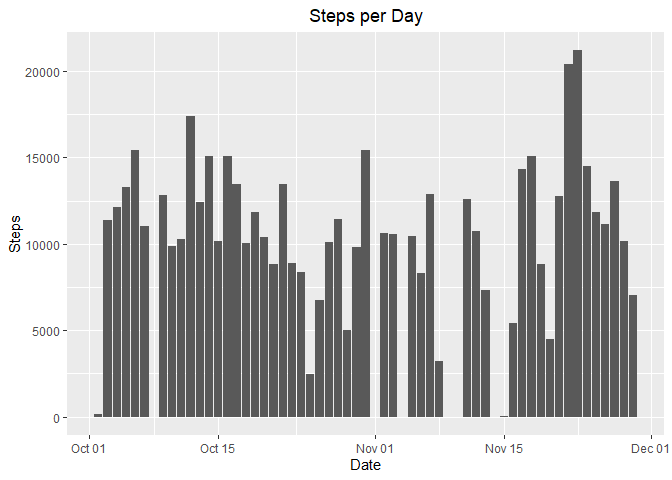
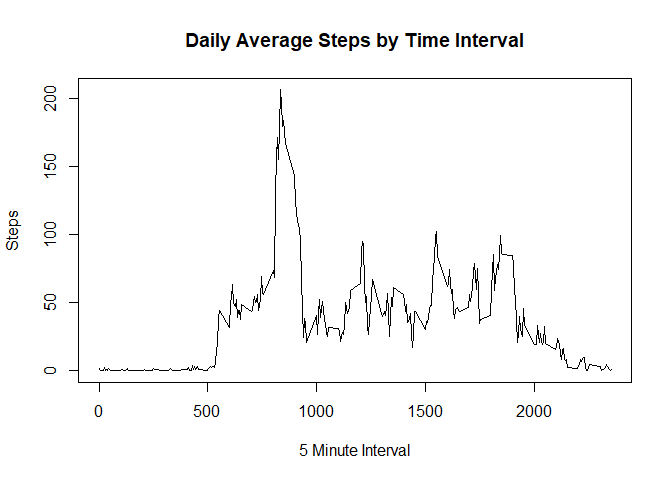
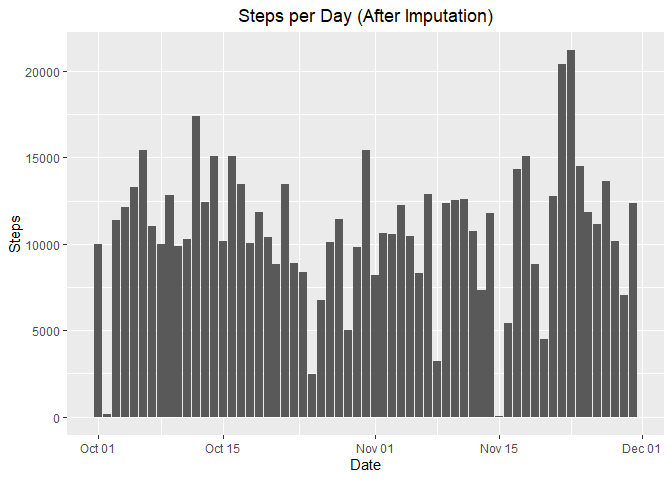
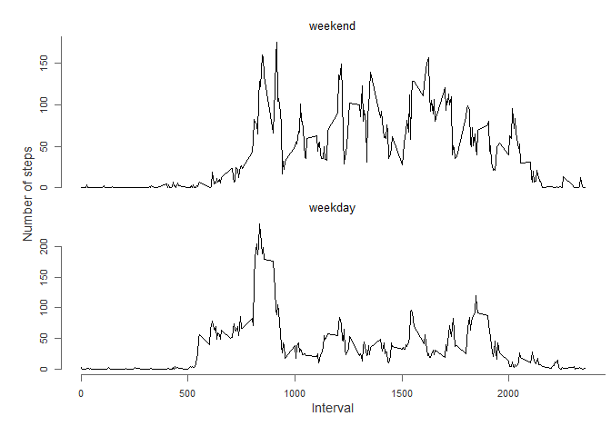

### Loading and preprocessing the data

```r
knitr::opts_chunk$set(fig.path="figures/")
rawData <- read.csv("activity.csv")
nrows <- nrow(rawData)
nIncompleteCases <- sum(!complete.cases(rawData))
incompleteRows <- which(is.na(rawData$steps))
```
There are 17568 observations; 2304 of them, or 13%, contain missing data.


```r
missingDates=rawData[incompleteRows[1],"date"]
for(i in 1:(length(incompleteRows)-1)) {
  if (incompleteRows[i+1] != incompleteRows[i]+1) missingDates = paste(missingDates,rawData[incompleteRows[i+1],"date"])
}
cleanData = na.omit(rawData)
```

These are the dates for which data is missing: 2012-10-01 2012-10-08 2012-11-01 2012-11-04 2012-11-09 2012-11-14 2012-11-30

Visual inspection shows that the missing values encompass entire days; therefore, those days will be entirely removed from  statistical consideration, leaving 15264 observations. 

### What is mean total number of steps taken per day?


```r
stepsPerDay <- aggregate(x = cleanData$steps, by = list(cleanData$date), FUN = sum)
names(stepsPerDay) = c("Date","Steps")
stepsPerDay$Date <- as.Date(stepsPerDay$Date , format = "%Y-%m-%d")

knitr::kable(stepsPerDay,align=c("l","r"))
```


|Date       | Steps|
|:----------|-----:|
|2012-10-02 |   126|
|2012-10-03 | 11352|
|2012-10-04 | 12116|
|2012-10-05 | 13294|
|2012-10-06 | 15420|
|2012-10-07 | 11015|
|2012-10-09 | 12811|
|2012-10-10 |  9900|
|2012-10-11 | 10304|
|2012-10-12 | 17382|
|2012-10-13 | 12426|
|2012-10-14 | 15098|
|2012-10-15 | 10139|
|2012-10-16 | 15084|
|2012-10-17 | 13452|
|2012-10-18 | 10056|
|2012-10-19 | 11829|
|2012-10-20 | 10395|
|2012-10-21 |  8821|
|2012-10-22 | 13460|
|2012-10-23 |  8918|
|2012-10-24 |  8355|
|2012-10-25 |  2492|
|2012-10-26 |  6778|
|2012-10-27 | 10119|
|2012-10-28 | 11458|
|2012-10-29 |  5018|
|2012-10-30 |  9819|
|2012-10-31 | 15414|
|2012-11-02 | 10600|
|2012-11-03 | 10571|
|2012-11-05 | 10439|
|2012-11-06 |  8334|
|2012-11-07 | 12883|
|2012-11-08 |  3219|
|2012-11-11 | 12608|
|2012-11-12 | 10765|
|2012-11-13 |  7336|
|2012-11-15 |    41|
|2012-11-16 |  5441|
|2012-11-17 | 14339|
|2012-11-18 | 15110|
|2012-11-19 |  8841|
|2012-11-20 |  4472|
|2012-11-21 | 12787|
|2012-11-22 | 20427|
|2012-11-23 | 21194|
|2012-11-24 | 14478|
|2012-11-25 | 11834|
|2012-11-26 | 11162|
|2012-11-27 | 13646|
|2012-11-28 | 10183|
|2012-11-29 |  7047|


```r
library(ggplot2)
ggplot(stepsPerDay, aes(x=Date, y=Steps)) + ggtitle("Steps per Day") +
  theme(plot.title = element_text(hjust = 0.5)) +
  geom_bar(stat="identity")
```

<!-- -->

Mean steps per day: 10,766.19   
Median steps per day: 10,765

### What is the average daily activity pattern?

```r
stepsPerInterval <- aggregate(x=cleanData$steps,by = list(cleanData$interval),FUN=mean)
names(stepsPerInterval) = c("Interval","Steps")
plot(main="Daily Average Steps by Time Interval",stepsPerInterval$Interval,stepsPerInterval$Steps,type="l",ylab="Steps",xlab="5 Minute Interval")
```

<!-- -->

Interval with average maximum number of steps: 835

### Imputing missing values

```r
datesList=strsplit(missingDates," ")
dates <- vector()
for (i in 1:length(datesList[[1]])) dates[i]=datesList[[1]][i]
dates=as.Date(dates,"%Y-%m-%d")
```
As noted above, there are 2304 rows of missing data.
The dates for which data is missing are
Monday Oct. 01, Monday Oct. 08, Thursday Nov. 01, Sunday Nov. 04, Friday Nov. 09, Wednesday Nov. 14, 
and Friday, Nov 30. Missing data will be imputed by averaging the step values for each interval for the same day of the week.

```r
imputedData <- rawData
for(i in 1:nrow(imputedData)) {
  if (is.na(imputedData[i,]$steps))
    imputedData[i,]$steps <-
      round(mean(cleanData[cleanData$interval==imputedData[i,]$interval
                      & format(as.Date(cleanData$date,"%Y-%m-%d"),"%a") ==
                        format(as.Date(imputedData[i,]$date,"%Y-%m-%d"),"%a"),]$steps))
  }
```

```r
stepsPerDay <- aggregate(x = imputedData$steps, by = list(imputedData$date), FUN = sum)
names(stepsPerDay) = c("Date","Steps")
stepsPerDay$Date <- as.Date(stepsPerDay$Date , format = "%Y-%m-%d")

ggplot(stepsPerDay, aes(x=Date, y=Steps)) + ggtitle("Steps per Day (After Imputation)") +
  theme(plot.title = element_text(hjust = 0.5)) +
  geom_bar(stat="identity")
```

<!-- -->

After imputing missing data - 
Mean steps per day: 10,821.10   
Median steps per day: 11,015

Adding more data - imputing more steps - raises the averages.

### Are there differences in activity patterns between weekdays and weekends?


```r
imputedData$days <- factor(ifelse(format(as.Date(imputedData$date,"%Y-%m-%d"),"%a")=="Sun" | format(as.Date(imputedData$date,"%Y-%m-%d"),"%a")=="Sat","weekend","weekday"))
imputedDataWeekend = imputedData[which(imputedData$days=="weekend"),]
weekendStepsPerInterval <- aggregate(x=imputedDataWeekend$steps,by = list(imputedDataWeekend$interval),FUN=mean)
names(weekendStepsPerInterval) = c("Interval","Steps")

imputedDataWeekday = imputedData[which(imputedData$days=="weekday"),]
weekdayStepsPerInterval <- aggregate(x=imputedDataWeekday$steps,by = list(imputedDataWeekday$interval),FUN=mean)
names(weekdayStepsPerInterval) = c("Interval","Steps")

par(mfrow = c(2, 1))
par(mar=c(0,0,2,0),oma = c(5, 5, 1, 0.5))
par(cex=.7)

plot(axes=F,main="weekend",font.main=1,weekendStepsPerInterval$Interval,weekendStepsPerInterval$Steps,type="l")
axis(2, col = "grey40", col.axis = "grey20", at = seq(0.0, 200, 50))

plot(axes=F,main="weekday",font.main=1,weekdayStepsPerInterval$Interval,weekdayStepsPerInterval$Steps,type="l")
axis(1, col = "grey40", col.axis = "grey20", at = seq(0.0, 2500, 500))
axis(2, col = "grey40", col.axis = "grey20", at = seq(0.0, 200, 50))


mtext("Interval",side=1,outer = TRUE, cex=.9, line = 2.2,col = "grey20")

mtext("Number of steps", side = 2, outer = TRUE, cex = .9, line = 2.2,col = "grey20")
```

<!-- -->
